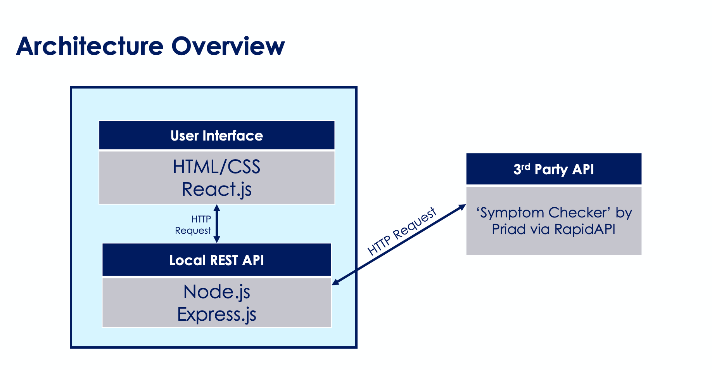
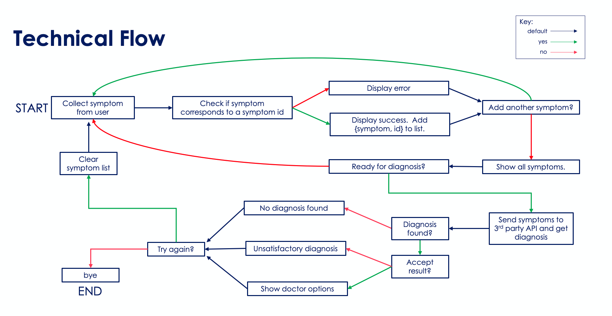
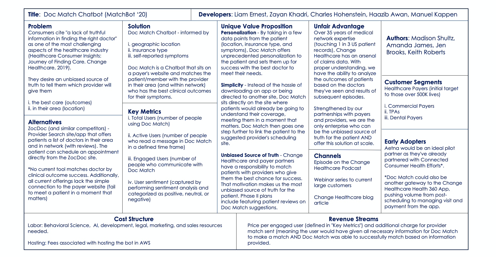

# MatchBot '20 (Doc Match Chat Bot)

## CHNG CodeFest 2020

### Team members:

- Haazib Awan
- Manuel Kappen
- Liam Ernest
- Zayan Khadri
- Charlie Hohenstein

### Initially presented at CHNG PitchFest2020

- Madison Shultz
- Amanda James
- Jen Brooks
- Keith Roberts

## Abridged Lean Canvas

### Problem

Consumers cite "a lack of truthful information in finding the right doctor" as one of the most challenging aspects of the healthcare industry (Healthcare Consumer Insights: Journey of Finding Care. Change Healthcare, 2019).

They desire an unbiased source of truth to tell them which provider will give them

- the best care (outcomes)
- in their area (location)

### Solution

Informed by

- geographic location
- insurance type
- self-reported symptoms

MatchBot 20 is a Chatbot that sits on a payer's website and matches the patient/member with the provider in their area (and within network) who has the best clinical outcomes for their symptoms.

## Description

The patient is already authenticated before the interaction begins.

We have their insurance and location. All we have to do is collect their symptoms.

The chat bot initiates the conversation with a greeting, then prompts the patient to start sending their symptoms.

In order to be successfully processed, the reported symptoms must match a symptom in a lookup table. This ensures that they can be paired with IDs which enable us to calculate a diagnosis. If a symptom is invalid, the user will be gently notified and prompted to add another.

The bot keeps a list and guides the patient through the addition of all their self-reported symptoms. On the patient's command, the bot sends the data off to the diagnosis API and waits for a response, which it then simplifies and presents.

Depending on the combination of symptoms, the diagnosis API might return a whole list, or it might not return anything. If a list is returned, the bot is just going to pick a random one to share. What it lacks in accuracy it makes up for in simplicity. The patient can request to see another diagnosis from the list if they're not satisfied with the first. If no diagnosis is found, the user may return to the beginning and re-enter their symptoms after reassessing their condition and lowering their standards.

In addition to a diagnosis, the bot will also inform the user which medical specialties are associated with their ailment. The patient deserves to feel confident that they're going to the right type of doctor. But in case that's not enough, the bot takes it a step further and picks a specific provider who can provide precisely the what the patient requires. The best part is, we already know for certain that this provider is in-network and nearby. This isn't one of those bots that talks up a doctor who lives 2 hours away and doesn't even accept your insurance.

If the patient isn't satisfied with their results, or wants to help their roommate search for a doctor too, they may choose to start the interaction over and enter a new list of symptoms. Otherwise, the bot says "bye" and it's over.

## Diagrams

## Resources

#### ChatBot React module

https://lucasbassetti.com.br/react-simple-chatbot/#/

#### Symptom Checker API

https://rapidapi.com/priaid/api/Symptom%20Checker

---

## Instructions for running locally

### Prerequisites

You must also clone the chat-bot-api repo here: https://gitlab.healthcareit.net/Liam.Ernest/chat-bot-api

You must have an API key for the symptom checker API: https://rapidapi.com/priaid/api/Symptom%20Checker

In the `chat-bot-api` directory, create an `.env` file in the project root and add the line:

`API_KEY = 'your-API-key-here'`

Install modules: `npm i`

---

### Start the application

In the `chat-bot` directory, `yarn start` starts the front end at [http://localhost:3000](http://localhost:3000)

From the chat-bot-api directory, `node index.js` starts the backend.
